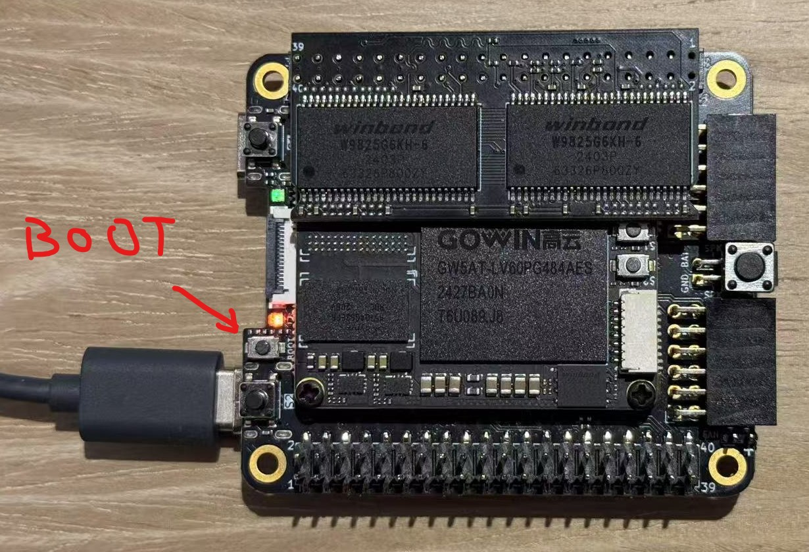

# TangCore Retro Gaming Installation Guide

## 🎮 Supported Devices

| Board Model       | FPGA Capacity | Compatible Cores             | Status        |
|-------------------|---------------|------------------------------|---------------|
| Tang Console 60K  | 60K LUT       | All cores                    | ✔️ Great  |
| Tang Mega 60K     | 60K LUT       | All cores                    | ✔️ Great   |
| Tang Mega 138K    | 138K LUT      | All cores                    | ✔️ Great   |
| Tang Primer 25K   | 25K LUT       | NESTang, SNESTang only       | ⚠️ Limited   |
| Tang Nano 20K     | 20K LUT       | *Unsupported*                | ❌ Not working   |

---

## 📦 Pre-Install Checklist
- [ ] Bouffalo Flash Cube v1.1 (in `tools/bflb_tools/bouffalo_flash_cube` of [Bouffalo SDK](https://github.com/bouffalolab/bouffalo_sdk), also a [local standalone version here](https://nand2mario.github.io/tangcore/user-guide/assets/bouffalo_flash_cube-1.1.zip))
- [ ] USB 2.0 drive (FAT32/exFAT, ≤32GB recommended)
- [ ] USB-C OTG adapter with **power pass-through**, needed for Tang Console and Tang Primer as these do not have USB Host ports.
- [ ] Valid GBA BIOS (`gba_bios.bin` MD5: `81977335...`)
- [ ] Latest [TangCore Release Package](https://github.com/nand2mario/tangcore/releases)

---

## 🔧 Firmware Installation

1. Extract release package
2. Launch Flash Cube → **Browse** → Select:
   ```bash
   /firmware-bl616/flash_<board-model>.ini
   ```
   *(e.g., `flash_tang_console_60k.ini`)*

3. Boot Mode Activation:
   - Hold **BOOT** button → Connect USB → Release after connection

   

4. Flash Process:
   - Refresh COM ports → Select Port/SN → **Download**
   - Confirm success screen:

     
   *Green status indicates successful programming*

---

## 🕹️ Game System Setup

### USB drive content
```bash
📁 /                
├── 📁 cores/        # `cores` directory from release
│    ├── 📁 console60k/
│    └── 📁 console138k/
├── 📁 nes/          # .nes rom files
├── 📁 snes/         # .smc/.sfc files
├── 📁 gba/
│    └── 🗎 gba_bios.bin  # Mandatory BIOS
├── 📁 genesis/      # .bin/.md files
└── 📁 sms/          # .sms files
```

### Hardware Assembly
1. Connect components as shown:  
   

   *Left: OTG+USB | Right: DS2 PMOD+Wireless Receiver | Top: HDMI output*

2. Power sequence:
   - Insert USB drive → Connect OTG → Apply power

3. Initial Boot:
   - FPGA auto-programs (5-7 sec)
   - Main menu appears 

   

   *Navigation using gamepad*

---

---

[Report Issue](https://github.com/nand2mario/tangcore/issues)

