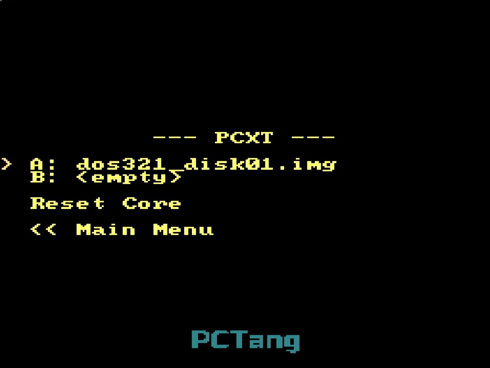

# IBM PC/XT core

## BIOS

The PC/XT core requires a BIOS to run. It should be located at `/pc/bios.bin` and 64KB in size. It is in the same format as the PCXT_MiSTer ROMs. You can look for PCXT_MiSTer ROM files.

A python script is also provided to assemble your own BIOS image. Run `python scripts/bios_make.py` and it should output the necessary `bios.bin`. An additional benefit of the script is you can choose to patch the original BIOS to skip the time-consuming memory check of the original BIOS, which makes loading much faster.

## Keyboard

As of TangCore 0.9, USB keyboard connected through the BL616 MCU is supported for the PC/XT. So you need to connect the USB keyboard with a USB hub. The onboard USB-A port is not supported yet.

In the PC/XT core, press **F12** to switch the OSD on and off.

## Using floppy images

Press **F12** to call out the OSD menu. Here you can load floppy images or reset the machine.

